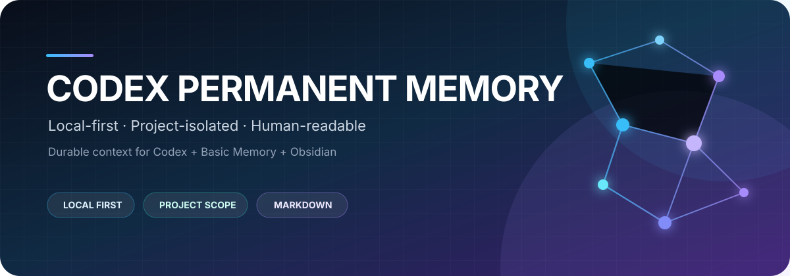
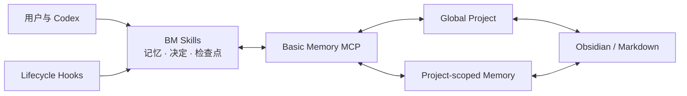
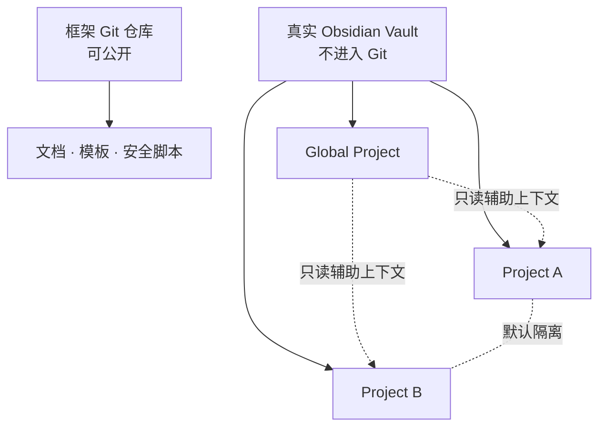

<p align="center">
  
</p>

<p align="center">
  <strong>让 Codex 在上下文压缩、任务切换和跨会话之后，仍然记得真正重要的事情。</strong>
</p>

<p align="center">
  <a href="./LICENSE"></a>
  
  
  <a href="https://github.com/basicmachines-co/basic-memory/releases/tag/v0.22.1"></a>
  
</p>

<p align="center">
  <a href="#快速开始">快速开始</a> ·
  <a href="./docs/architecture.md">核心架构</a> ·
  <a href="./docs/deployment-guide.md">部署指南</a> ·
  <a href="./docs/user-guide.md">使用手册</a> ·
  <a href="./SECURITY.md">安全规范</a>
</p>

---

## 这是什么

Codex Permanent Memory 是一个面向 **Codex + Basic Memory + Obsidian** 的本地长期记忆参考框架。

它不会保存所有聊天，而是在合适的时机把目标、决定、经验、验证结果和任务交接整理成结构化 Markdown。Obsidian 负责让人阅读与整理，Basic Memory 负责按 Project 建立索引和关系，Codex 则在新任务或上下文恢复时取回相关内容。

> [!IMPORTANT]
> 本仓库只保存框架、模板、脚本和文档。真实记忆、索引、数据库、私有配置及备份必须存放在本 Git 仓库之外。

<table>
  <tr>
    <td width="50%">
      <strong>🧭 可恢复任务</strong><br>
      用不可覆盖的检查点保存目标、现场证据、阻塞和唯一下一步。
    </td>
    <td width="50%">
      <strong>🧱 项目级隔离</strong><br>
      全局记忆与各项目使用独立 Basic Memory Project，默认互不串线。
    </td>
  </tr>
  <tr>
    <td width="50%">
      <strong>📝 人类可读</strong><br>
      Markdown 是可检查、可编辑、可迁移的源文件，不被锁在聊天窗口里。
    </td>
    <td width="50%">
      <strong>🔒 本地优先</strong><br>
      Vault 路径由用户指定；脚本不安装依赖、不上传数据、不自动注册 Project。
    </td>
  </tr>
</table>

## 它如何工作



| 场景 | 写入位置 | 典型内容 |
| --- | --- | --- |
| 普通 AI 对话 | 全局 Project | 稳定偏好、通用知识、非项目经验 |
| 代码或工作项目 | 当前项目 Project | 检查点、项目决定、仓库事实 |
| 长对话发生压缩 | 当前作用域的检查点目录 | 已完成工作、验证、阻塞、下一步 |
| 项目经验可以复用 | 先留在项目，经确认后提升 | 脱敏后的跨项目经验 |

更完整的数据链路、作用域结构和恢复流程见[核心架构](./docs/architecture.md)。

## 快速开始

### 1. 克隆框架

```powershell
git clone https://github.com/Ryan-wu-web/CodexPermanentMemory.git
Set-Location CodexPermanentMemory
```

### 2. 在仓库外创建记忆目录

将 `<VAULT_PATH>` 替换成你自己的仓库外目录：

```powershell
pwsh -NoProfile -File scripts/New-CodexMemoryLayout.ps1 `
  -VaultPath '<VAULT_PATH>' `
  -ProjectSlug 'example-project'
```

脚本会创建全局区和一个示例项目区，但不会安装软件、修改 Codex 配置、覆盖已有 README 或注册 Basic Memory Project。

```text
<VAULT_PATH>/
├── global/                    # 普通对话、偏好、知识与跨项目经验
└── projects/
    └── example-project/       # 该项目独占的检查点、决定与事实
```

### 3. 安装并映射 Basic Memory

按照[部署指南](./docs/deployment-guide.md)安装 Basic Memory Codex 插件，然后分别注册：

- `<VAULT_PATH>/global` → `<GLOBAL_MEMORY_PROJECT>`
- `<VAULT_PATH>/projects/example-project` → `<PROJECT_MEMORY_PROJECT>`

不要注册 `<VAULT_PATH>` 根目录，也不要让两个 Project 的路径重叠或互相包含。

### 4. 复制配置模板

| 配置层级 | 模板 | 目标位置 |
| --- | --- | --- |
| 用户级全局记忆 | [`templates/user/basic-memory.example.json`](./templates/user/basic-memory.example.json) | `~/.codex/basic-memory.json` |
| 项目级记忆 | [`templates/project/basic-memory.example.json`](./templates/project/basic-memory.example.json) | `<PROJECT_ROOT>/.codex/basic-memory.json` |

复制后替换其中的 `<PLACEHOLDER>`。填入真实 Project 名称和仓库标识后的配置不要提交回本仓库。

### 5. 运行验收

```powershell
pwsh -NoProfile -File tests/Test-NewCodexMemoryLayout.ps1
pwsh -NoProfile -File scripts/Test-CodexMemoryFramework.ps1
```

预期结果：

```text
LAYOUT_TEST=PASS
FRAMEWORK_TEST=PASS
```

## 日常怎么用

| 目标 | Codex 中的 Skill | 适用时机 |
| --- | --- | --- |
| 保存小事实 | `$bm-remember` | “记住我的文档偏好” |
| 记录工程决定 | `$bm-decide` | 方案选择、理由与后果需要长期保留 |
| 创建任务交接 | `$bm-checkpoint` | 长任务、上下文压缩或准备换会话 |
| 恢复历史工作 | `$bm-orient "<标识或主题>"` | 新任务接着上次进度继续 |
| 检查部署状态 | `$bm-status` | 排查 Project、Hook 或配置问题 |

详细示例和“会话尚未绑定项目时怎么办”见[日常使用手册](./docs/user-guide.md)。

## 隐私设计



三层边界共同降低泄漏与串线风险：

1. **物理分离**：真实 Vault 与框架 Git 仓库位于不同目录。
2. **检索隔离**：全局区与各项目分别注册为独立 Basic Memory Project。
3. **提交检查**：静态验证器扫描真实路径、私有项目标识、凭据模式和配置占位符。

私有 GitHub 仓库也不是加密保险箱。完整规则与泄漏处理见[安全与隐私](./SECURITY.md)。

## 仓库结构

```text
.
├── .github/assets/readme/     # README 主视觉
├── docs/                      # 架构、部署与使用文档
├── scripts/                   # 目录脚手架与静态验证
├── templates/                 # 用户级、项目级和 Vault 模板
├── tests/                     # PowerShell 行为测试
├── LICENSE
├── SECURITY.md
└── README.md
```

## 文档地图

| 文档 | 适合谁 | 解决什么问题 |
| --- | --- | --- |
| [核心架构](./docs/architecture.md) | 想理解原理的人 | 保存链路、Project 隔离、压缩与恢复 |
| [部署指南](./docs/deployment-guide.md) | 首次安装者 | 从空环境部署到隔离验收 |
| [日常使用手册](./docs/user-guide.md) | 日常使用者 | 什么时候保存、保存到哪里、如何恢复 |
| [安全与隐私](./SECURITY.md) | 维护者与贡献者 | 禁止入库的数据、扫描与泄漏处理 |

## 依赖与许可证

- [Basic Memory](https://github.com/basicmachines-co/basic-memory) 是外部项目；本参考实现以 [`v0.22.1`](https://github.com/basicmachines-co/basic-memory/releases/tag/v0.22.1) 为基线，不复制其源码。
- Codex 属于 OpenAI；安装和插件能力以 [Codex 官方文档](https://developers.openai.com/codex/) 为准。
- 本仓库采用 [MIT License](./LICENSE)。外部依赖继续遵守各自许可证，本仓库不代表 OpenAI 或 Basic Machines。

## 当前状态与贡献

这是一个 **Windows / PowerShell 7 优先**的参考实现。欢迎通过 GitHub Issue 提交文档纠错、跨平台脚本和隔离测试改进，但请勿附带真实记忆、绝对私有路径或凭据。

修改后至少运行：

```powershell
pwsh -NoProfile -File tests/Test-NewCodexMemoryLayout.ps1
pwsh -NoProfile -File scripts/Test-CodexMemoryFramework.ps1
git status --short
```

静态扫描用于降低风险，不能替代人工审阅 Git 差异。
