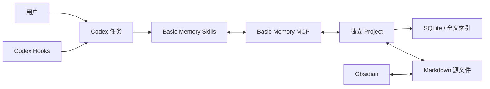
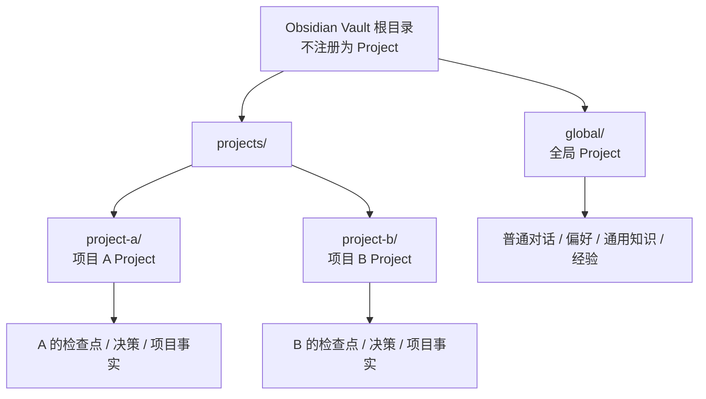
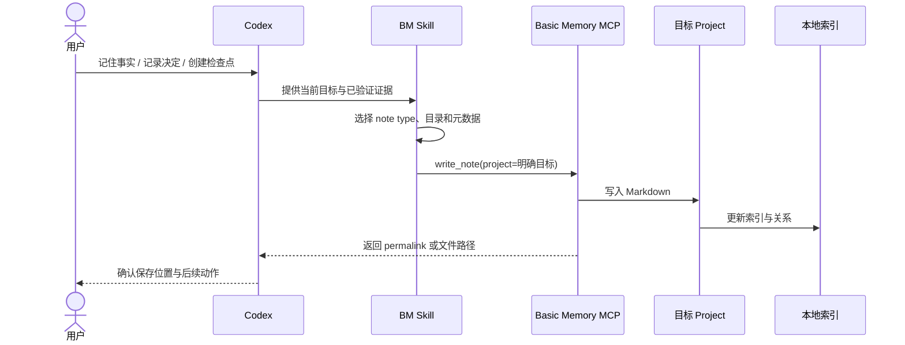
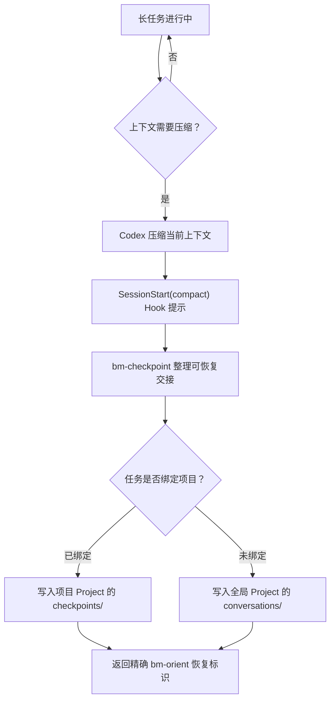
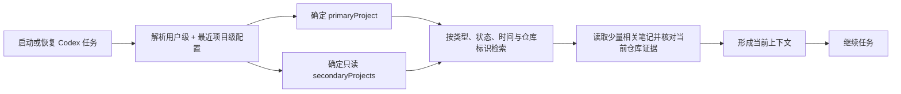

# 核心架构

## 一句话理解

这套框架不是把整段聊天塞回提示词，而是让 Codex 在合适的时机把“值得长期保留的内容”写成结构化 Markdown，由 Basic Memory 建立本地索引和关系，再在新任务或恢复任务时按作用域取回。

真实记忆位于使用者自己的 Obsidian Vault；本 Git 仓库只保存框架、模板和脚手架。

## 组件职责

| 组件 | 负责什么 | 不负责什么 |
| --- | --- | --- |
| Codex | 理解当前任务，决定何时读取或写入记忆 | 不把每句话自动永久保存 |
| Basic Memory Skills | 定义记忆、决定、检查点、恢复等工作流 | 不是独立数据库 |
| Codex Hooks | 在任务启动、恢复、上下文压缩等生命周期节点提供提示与本地事件轨迹 | 不直接替代理撰写知识笔记 |
| Basic Memory MCP | 向 Codex提供搜索、读取、写入和关系操作 | 不扩大到未配置的目录 |
| Basic Memory Project | 定义独立的读写边界和索引范围 | 不应与另一个 Project 路径重叠 |
| SQLite/全文索引 | 加速本地检索，保存可重建的索引状态 | 不是记忆的唯一源文件 |
| Markdown | 人可读、可编辑、可迁移的记忆源文件 | 不自动决定哪些内容重要 |
| Obsidian | 浏览、链接和人工整理 Markdown | 不是 Codex 与 Basic Memory 之间的必需协议层 |

## 两层作用域：全局记忆与项目记忆

“一个总 Vault”只解决人工浏览问题，不能天然解决检索隔离。真正的隔离单位是 Basic Memory Project：全局区域注册为一个 Project，每个工作项目再注册为自己的 Project。

默认路由如下：

- 没有绑定项目的普通对话写入全局 Project。
- 在某个代码仓库中的任务写入该仓库对应的项目 Project。
- 项目配置可把全局 Project 作为辅助读取来源，用于读取稳定偏好和通用经验。
- 项目 A 与项目 B 默认互不可见，避免相似术语把无关记忆召回。
- 项目经验只有经过总结、脱敏和用户确认，才提升到全局 Project。

这意味着“一个 Vault 里有很多项目”不会自动混乱：Obsidian 可以统一浏览，Basic Memory 则按 Project 做检索边界。

## 记忆如何保存

一次写入不是简单追加聊天记录。对应 Skill 会把当前信息整理成标题、类型、状态、观察和关系，再通过 MCP 写到明确的 Project。

保存后的 Markdown 是主要的可读资产；索引用于检索，可以重新构建。不要把“向量库”理解成另一个会无限吞入所有聊天的黑盒：是否启用语义检索取决于 Basic Memory 配置，而 Project 边界始终比相似度更先决定搜索范围。

## 长对话压缩时发生什么

Codex 的上下文窗口不是永久存储。长任务发生压缩时，Basic Memory 插件的生命周期 Hook 会让恢复后的代理创建一份“人为整理的检查点”。检查点记录原始目标、最新意图、已完成内容、验证、决定、阻塞和唯一下一步，而不是复制完整逐字稿。

如果压缩时还没有绑定项目，检查点进入全局 `conversations/`，并明确标记当时的上下文和不确定范围。以后确认它属于某项目时，可以创建项目决策或新检查点并建立关系；不要静默移动原始检查点，因为原始记录本身也是时间证据。

## 新任务如何回忆

记忆只提供上下文，不是高优先级指令。恢复时仍以用户当前要求、仓库内规则和现场文件为准；旧笔记若与当前 Git 状态冲突，应把差异明确展示出来。

## 配置合并

用户级 `~/.codex/basic-memory.json` 提供通用默认值；距离当前目录最近的项目级 `.codex/basic-memory.json` 按键覆盖用户级配置。

典型设计是：

- 用户级配置选择全局 Project，并使用 `general` 会话类型。
- 代码仓库的项目级配置只覆盖 `primaryProject`、`secondaryProjects`、`sessionProfile`、`repository` 和项目目录约定。
- `coding` 类型必须有可验证的 Git 仓库标识、分支和 SHA；尚无首个 commit 的项目先使用 `general`。

## 安全边界

- MCP 只能访问 Basic Memory 已配置的 Project，不应把 Vault 根或整个用户目录注册进去。
- Hook 捕获的是本地生命周期事件轨迹；它不会自动变成知识图谱笔记，也不会自动发到团队 Project。
- 凭据、密码、令牌、私钥和完整逐字稿禁止进入记忆。
- 本框架仓库与真实 Vault 必须分开；`.gitignore` 是最后一道辅助防线，不是数据隔离本身。

## 取舍

这种设计多了一步 Project 映射和路由配置，但换来清晰的所有权、可解释的检索范围和可迁移的 Markdown。它追求的是“少量、经过整理、可恢复的长期记忆”，不是无限保存所有对话。
